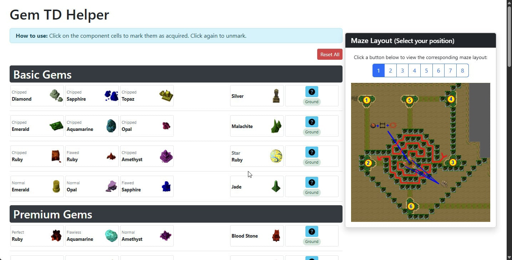

# Gem TD+ Helper

An interactive web-based tool to help players of Gem TD+ (a Warcraft III custom map) track gems, plan tower combinations, and optimize their defense strategy.

## 🎮 [Try it out](https://gemtd.top/)



## Features

- **Track Gem Collections**: Click on gems to mark them as acquired during your game
- **Tower Combinations**: Complete reference guide for all gem combinations
- **Tower Information**: Detailed stats for every tower type
- **Optimal Maze Design**: Reference design for maximum path length
- **Persistent Storage**: Your acquired gems are saved between sessions

## How to Use

1. Visit the [Gem TD+ Helper](hhttps://gemtd.top/) web app
2. Click on gems to mark them as acquired (they'll highlight in green)
3. Use the information buttons (ⓘ) to view detailed tower stats
4. Reference the maze design for optimal tower placement

## Strategy Tips

- **Premium Targets**: Focus on building Dark Emerald, Yellow Sapphire, and Ancient Slate towers
- **Ancient Slates**: Place three of these close together near your center
- **Early Game**: Blood Stone is most effective when acquired early
- **Economy**: Jade is primarily useful for its gold-generating upgrade

## Development

### Prerequisites

- A modern web browser
- Basic knowledge of HTML, CSS, and JavaScript

### Local Setup

```bash
# Clone the repository
git clone https://github.com/gemtd-top/gemtd-top.git

# Navigate to the project directory
cd gemtd-top

# Open index.html in your browser